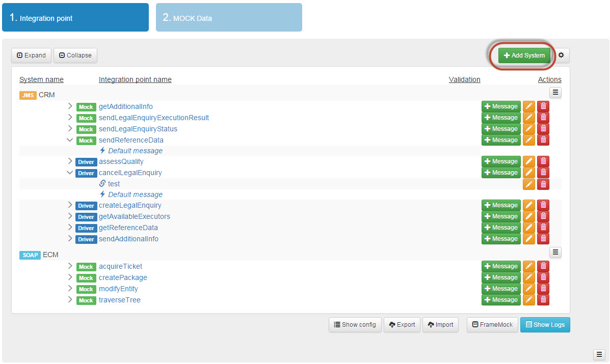
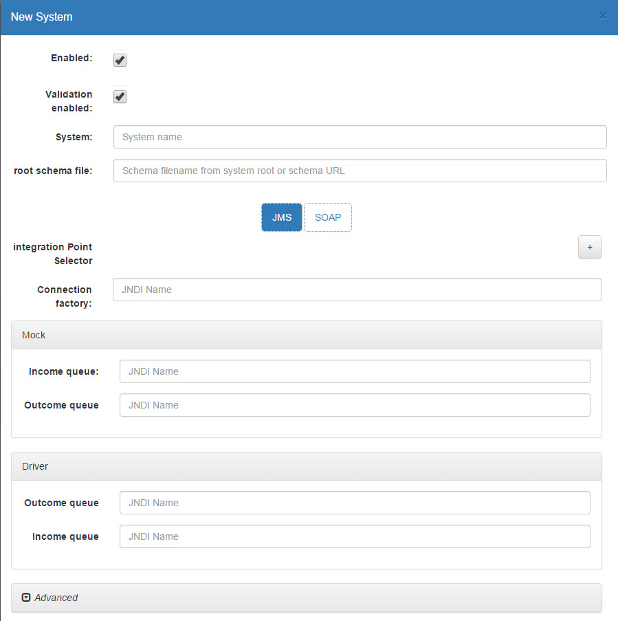

= Инструкция пользователя эмулятора
Версия: {version}

== Словарь терминов

.Словарь терминов
|===
|Термин |Определение

|Driver(Драйвер) |функционал, эмулирующий запросы со стороны внешней АС к
 разрабатываемой АС, согласно ТЗ на интеграцию

|Mock(Заглушка) |функционал, эмулирующий ответы внешней АС на запросы со стороны
 разрабатываемой АС, согласно ТЗ на интеграцию
|Система | Сущность, определяющая АС, с которой осуществляется взаимодействие. (Глушение или отсылка запросов)
|Точка интеграции | Сущность определяющая метод или пару сообщений, образующих интеграцию двух АС
|Шаблон сообщения | Набор данных, позволяющий сформировать ответ эмулятора на входящий запрос.
 В случае использования драйвера, шаблон - предсохранённое сообщение
|Connection factory |Фабрика подключения к MQ серверу, настраивающаяся на стороне сервера приложений
|Корневой элемент |Элемент, являющийся первым в передаваемом интеграционном сообщении
|Integration point Selector |Xpath, указывающий на элемент, определяющий имя точки интеграции.
|Диспетчеризация |Способ выборки шаблонов ответа в точке интеграции по преднастроенным правилам
|DSS |Dynamic System Settings - системные настройки PRPC Pega
|JMS |Java Message Service - стандарт промежуточного ПО для рассылки сообщений, позволяющий приложениям, выполненным на платформе
 Java EE, создавать, посылать, получать и читать сообщения. Используется для взаимодействия Java приложения с MQ сервером
|JNDI |Java Naming and Directory Interface - набор Java API, организованный в виде службы каталогов, который позволяет Java-клиентам
 открывать и просматривать данные и объекты по их именам. Используется для получения Connection Factory и названий очередей для JMS систем

|===

== Конфигурация заглушки

'''

=== Предварительные условия

* На WebSphere настроены очереди, с которыми будет работать Эмулятор
* Эмулятор установлен на WebSphere
* Наличие актуальных ``xsd``/``wsdl`` схем для всех точек интеграции, которые планируются быть реализованными

=== Добавление системы

. На вкладке Integration point нажать кнопку ``Add System``

. В появившемся окне указать следующие данные:
  .. Название системы
  .. Имя файла с корневым элементом (с указанием пути относительно корневой папки системы)
  .. Тип интеграционного взаимодействия (``JMS``/``SOAP``)
  [[img-addSystemWindow]]
  
. Если тип взаимодействия - ``SOAP``, перейти к п.4, иначе нужно заполнить данные по очередям для ``JMS``:
  .. ``JNDI`` имя для Connection factory
  .. ``JNDI`` имена для используемых очередей (входящей/исходящей) для ``Driver`` и/или ``Mock``
. Нажать кнопку Save
. Дождаться появления системы в общем списке на главной странице Эмулятора
. Нажать на кнопку с доступными действиями по системе (напротив названия системы в колонке Actions) и выбрать действие подгрузить схемы (Upload schema)
. В появившемся диалоговом окне нажать на Browse
. Выбрать нужный архив (формат ``*.zip``, сжатый стандартными средствами Windows), который содержит в себе достаточный набор схем с сохранением вложенности **по одной системе**
. Нажать ``Upload``
. Если тип взаимодействия - ``SOAP``, перейти к п.13. Для ``JMS`` - в меню доступных действий по системе выбрать ``Edit system``
. Указать ``Integration point Selector``
  .. На против поля ``Integration point selector`` нажать кнопку "+"
  .. В поле "Элементы" элементы фильтруются по namespace, если он задан. Если namespace не задан, то элементы ищутся по всем namespace определенным для системы
  .. При выборе элемента namespace подставляется автоматически согласно его принадлежности
. Нажать ``Save``
. Система добавлена в Эмулятор

TIP: При вводе ``JNDI`` имен, проверяется существование указываемых очередей, и индикатор в текстовом поле показывает корректность данных.

TIP: При указании ``Integration point Selector`` заполнение осуществляется по частичному вводу имени namespace и element name. Можно заполнять только element name, а namespace подставится автоматически.

=== Добавление точки интеграции

 . В меню действия по системе выбрать ``Add integration point``
 [[img-addIntegrationPoint]]
 
 . В появившемся окне выбрать из выпадающего списка доступных точек интеграций по системе (``Integration point name``) одну
 . Указать тип точки интеграции (``Driver``/``Mock``)
 . При необходимости указать эмулируемую задержку ответа от внешней системы (в мс)
 . Если тип взаимодействия - ``SOAP``, перейти к п.6 . Для ``JMS`` - необходимо указать ``Xpath`` для сообщения, которое должно возвращаться по данной точке интеграции. Указывается только для ``Mock``.
     .. В поле "Элементы" элементы фильтруются по namespace, если он задан. Если namespace не задан, то элементы ищутся по всем namespace определенным для системы
     .. При выборе элемента namespace подставляется автоматически согласно его принадлежности
    [[img-addIntegrationPointWindow]]
    
 . Нажать ``Save``
 . Точка интеграции добавлена в Эмулятор (по умолчанию создан шаблон, который будет возвращаться в случае, если не сработает ни одно из правил диспетчеризации)

=== Настройка ответа от Эмулятора для интеграционной точки

. Нажать на точку интеграции и выбрать нужный шаблон (после создания точки доступен только шаблон ``Default``)
. Открывается вкладка Driver/Mock Data, на которой доступно три области: ``Message``, ``Response``, ``Script``/``Test``
. Сгенерировать шаблон сообщения по xsd-схеме, нажав кнопку Regenerate для окна Message. Если тип интеграционной точки - Mock, нужно гненерировать тестовое входящее сообщение с помощью аналогичной кнопки в области Test.
. Заполнить сообщение по примеру сообщений с промышленной среды/ ИФТ стенда
. Для динамической параметризации и парсинга значений из входящего сообщения добавить нужный код на Groovy в окно Script.
. Для проверки корректности кода скрипта и валидности данных сообщения нажать кнопку Validate: в случае наличия ошибок появится всплывающее окно с их описанием в правом нижнем углу.
. Если проверка успешна (появляется всплывающее сообщение "Valid" в правом нижнем углу), нужно сгенерировать тестовое сообщение, нажав кнопку Test, и убедиться в правильности данных.
. После завершения настроек нажать кнопку ``Save``.

=== Добавление шаблона ответа интеграционной точки

. Через основное меню заглушки (вызов - кнопка в правом нижнем углу главного окна) включить возможность редактирования систем (пункт меню Enable editing)
 [[img-enableEditing]]
 
. На нужной точке интеграции нажать на кнопку добавления шаблона +Message
 [[img-enableEditingOn]]
 
. В появившемся окне ввести требуемые данные:
  .. Условное название шаблона (``Message template caption``) -- текст по которому все будут понимать, что это за шаблон. Не участвует в диспетчеризации
  .. Указать тип диспетчеризации
  .. Если тип ``SEQUENCE``, то в диспетчеризации шаблон будут использован только, когда точка интеграции получит флаг sequence enabled (по умолчанию выключен; включается в настройках интеграционной точки).
  Если тип диспетчеризации отличается от ``SEQUENCE`` (последовательного вызова), необходимо заполнить дополнительные поля:
  ... в случае ``Xpath`` и скрипта на ``GROOVY`` - выражение (код) для поиска нужного элемента/текста во входящем сообщении и ожидаемое строковое значение, в случае ``GROOVY`` код должен это значение вернуть (return);
  ... в случае использования ``REGEX`` - регулярное сообщение, шаблон для представления найденных групп и ожидаемое строковое значение. Шаблон групп задаётся :«$1$2», где 1 и 2 – это номера групп для извлечения.
 [[img-addMessage]]
 
. Нажать ``Save``
. После этого шаблон появится во вложенном списке интеграционной точки, готовый для настройки.

[[img-newTemplate]]

== Работа с заглушкой

'''

Для начала работы Эмулятора с целевой системой нужно:

. Удостовериться, что доступны (включены) все листенеры или ``Activation Specification``
. Для SOAP взаимодействия изменены значения в ``DSS`` нужных endpoint-ов: на \\http:{ip_host}:{port}/mock/ws/{system_name}, где system_name (Case sensitive)  - название системы с веб-сервисами, указанное в Эмуляторе.

=== Панель логов

В процессе работы с заглушкой при необходимости можно анализировать лог входящих/исходящих сообщений.

. Для этого нужно выбрать из основного меню эмулятора опцию ``Show logs``.
. После этого откроется таблица с логами. По умолчанию она отсортирована по времени регистрации сообщения.
. При необходимости можно отсортировать сообщения по любой колонке или отфильтровать по следующим колонкам: Protocol, SystemName, IntegrationPointName, FullEndpoint, ShortEndpoint, MessageState.
. Так же в верхнем правом углу находится строка поиска, которая позволяет найти частичные совпадения в том числе, и в текстах сообщений.
. При нажатии на строку в таблице, становится доступен просмотр сообщения.

При возникновении проблем при тестировании интеграционного взаимодействия АС, например, при появлении сообщений о недоступности внешней системы, необходимо анализировать логи заглушки.
Наличие ошибок можно определеить по столбцу ``MessageState``. Возможные статусы сообщений указаны в таблице ниже:

.Статусы сообщений
|===
|Навзание типа |Описание

|RCVPE
|Получено, но не определена точка интеграции

|RCV
|Получено успешно

|RCVVE
|Ошибка валидации полученного сообщения

|SNT
|Отравлено успешно

|SNTVE
|Ошибка валидации исходяшего сообщения

|NANS
|Ответ не требуется
|===

Если работы по тестированию блокируются дефектом, связанным с валидацией интеграционных сообщений, есть возможность отключить валидацию до исправления дефекта.

=== Отключение валидации

Отключить валидацию входящих/исходящих сообщений можно на нескольких уровнях:

. Точки интеграции.
  .. Во включенном режиме редактирования (``Enable editing`` в основном меню) нажать на кнопку редактировать напротив имени точки интеграции.
  .. Открыть расширенные настройки, расрыв область ``Advanced``.
  .. Убрать галочку в чек боксе ``Validation enabled``.
  .. Нажать ``Save``.
. Системы:
  .. В меню доступных действий по системе выбрать Edit System.
  .. Убрать галочку в чек боксе ``Validation enabled``.
  .. Нажать ``Save``.
. Всех систем:
  .. Нажать на кнопку Настройки на главное странице
  .. Убрать галочку в чек боксе ``Enable Global message validation``
  .. Нажать ``Save``.

=== Отключение точек интеграции

Аналогично, можно временно отключить точки интеграции.

. На уровне точки интеграции.
  .. Во включенном режиме редактирования (``Enable editing`` в основном меню) нажать на кнопку редактировать напротив имени точки интеграции.
  .. Убрать галочку в чек боксе ``Enabled``.
  .. Нажать ``Save``.
. На уровне системы:
    .. В меню доступных действий по системе выбрать ``Edit System``.
    .. Убрать галочку в чек боксе ``Enabled``.
    .. Нажать ``Save``.

=== Редактирование точек интеграции/диспетчеризации

Для изменения настроек необходимо включить возможность редактирования (``Enable editing`` в основном меню) после этого становятся доступны следующие действия:

. Для шаблона ответа:
 .. Редактирование настроек диспетчеризации;
 .. Удаление шаблона ответа.
. Для точки интеграции:
 .. Редактирование настроек точки интеграции;
 .. Добавление шаблона ответа;
 .. Удаление точки интеграции.

=== Frame Mock

== Приложение

=== Динамическая генерация полей сообщения

==== Скрипт:
[source,groovy]
response.reqTime = new java.util.Date().format("yyyy-MM-dd'T'hh:mm:ss")
response.prob = new Random().nextInt(10)*10
response.messageID=org.apache.commons.lang.RandomStringUtils.randomNumeric(32)

==== Сообщение:
[source,xml]
<ns:Envelope xmlns:ns="http://sbrf.ru/">
  <ns3:Header xmlns:ns3="http://sbrf.ru/ESB/mq/headers">
    <ns3:message-id>${messageID}</ns3:message-id>
    <ns3:request-time>${reqTime}</ns3:request-time>
    <ns3:operation-name>RatingFinalPDRs</ns3:operation-name>
    <ns3:user-name>user${org.apache.commons.lang.RandomStringUtils.randomNumeric(6)}</ns3:user-name>
  </ns3:Header>
  <ns:Body>
    <ns1:RatingFinalPDRs xmlns:ns1="http://sbrf.ru/NCPCA/AMRLiRT/RatingFinalPDRs/">
      <ns1:Status>
        <ns4:StatusCode xmlns:ns4="http://sbrf.ru/NCPCA/AMRLiRT/CommonTypes/">0</ns4:StatusCode>
    </ns1:Status>
      <ns1:DefaultProbability>${prob}</ns1:DefaultProbability>
    </ns1:RatingFinalPDRs>
  </ns:Body>
</ns:Envelope>

=== Парсинг входящего сообщения

==== Скрипт:
[source,groovy]
def ns= new groovy.xml.Namespace("http://sbrf.ru/NCPCA/DIS/ChangeUnderwritingDecisionStatusMessageElements/")
def ns2= new groovy.xml.Namespace("http://sbrf.ru/NCPCA/DIS/ChangeUnderwritingDecisionStatusRq/")
response.DISRequestID = requestDom[ns.Body][ns2.ChangeUnderwritingDecisionStatusRq][ns2.DataFields][ns2.DISHeaders][ns2.DISRequestID].text()
response.underwriterWorkID=requestDom[ns.Body][ns2.ChangeUnderwritingDecisionStatusRq][ns2.DataFields][ns2.DISHeaders][ns2.UnderwriterWorkID].text()
response.reasonCount = ru.sbt.bpm.mock.spring.utils.XmlUtils.evaluateXpath(request,'count(//*:Reason)')

==== Сообщение:
[source,xml]
<ns:Envelope xmlns:ns="http://sbrf.ru/NCPCA/DIS/ChangeUnderwritingDecisionStatusMessageElements/">
  <ns:Body>
    <ns1:ChangeUnderwritingDecisionStatusRs xmlns:ns1="http://sbrf.ru/NCPCA/DIS/ChangeUnderwritingDecisionStatusRs/">
      <ns1:DataFields>
        <ns1:DISHeaders>
          <ns1:DISRequestID>${DISRequestID}</ns1:DISRequestID>
          <ns1:UnderwriterWorkID>${underwriterWorkID}</ns1:UnderwriterWorkID>
        </ns1:DISHeaders>
        <ns1:ReasonCount>${reasonCount}</ns1:ReasonCount>
        <ns1:Status>
          <ns1:StatusCode>0</ns1:StatusCode>
          <ns1:ServerStatusCode>E0</ns1:ServerStatusCode>
          <ns1:StatusDesc>OK</ns1:StatusDesc>
        </ns1:Status>
      </ns1:DataFields>
    </ns1:ChangeUnderwritingDecisionStatusRs>
  </ns:Body>
</ns:Envelope>

=== Диспетчеризация по Xpath

[source,c]
/ //*:Product/*:NetMargin/text()
count('//*:Products//*:Product/*:NetMargin')
/*:ObjectID[contains(text(), '0000')]/text()
